+++
title = "Hacking Lab Demonstration"
subtitle = ""

# Add a summary to display on homepage (optional).
summary = "A complete demo of setting up a pentest lab and configuring a network range for exploiting machines"

date = 2019-08-03T15:11:08-07:00
draft = false

# Authors. Comma separated list, e.g. `["Bob Smith", "David Jones"]`.
authors = []

# Is this a featured post? (true/false)
featured = true

# Tags and categories
# For example, use `tags = []` for no tags, or the form `tags = ["A Tag", "Another Tag"]` for one or more tags.
tags = ["vmware","ubuntu","metasploit","debian","kali","metasploitable2"]
categories = ["InfoSec","Tutorial","Opensource"]

# Projects (optional).
#   Associate this post with one or more of your projects.
#   Simply enter your project's folder or file name without extension.
#   E.g. `projects = ["deep-learning"]` references
#   `content/project/deep-learning/index.md`.
#   Otherwise, set `projects = []`.
# projects = ["internal-project"]

# Featured image
# To use, add an image named `featured.jpg/png` to your page's folder.
[image]
  # Caption (optional)
  caption = ""

  # Focal point (optional)
  # Options: Smart, Center, TopLeft, Top, TopRight, Left, Right, BottomLeft, Bottom, BottomRight
  focal_point = ""
+++

## Scope

This lab manual provides a complete demonstration of a penetration test lab. It consists of the following sections:
- Diagram of the network range
- How to create the target range
  - Downloading software and images
  - Configuring the network topology within VMware
  - Configuring the machines
- A penetration testing methodology
- Applying the testing methodology to the target range
- A summary report of findings, including a description, analysis & exposure, and recommendations for remediation

## Objectives

- Provide example steps on how to create a virutal environment for simulating penetration tests
- Provide example penetration testing methodology
- Apply methodology to create range
- Attempt gaining privileged access to target machine(s)
- Provide summary report detailing vulnerability analysis, and recommend remediation steps

## Network Diagram

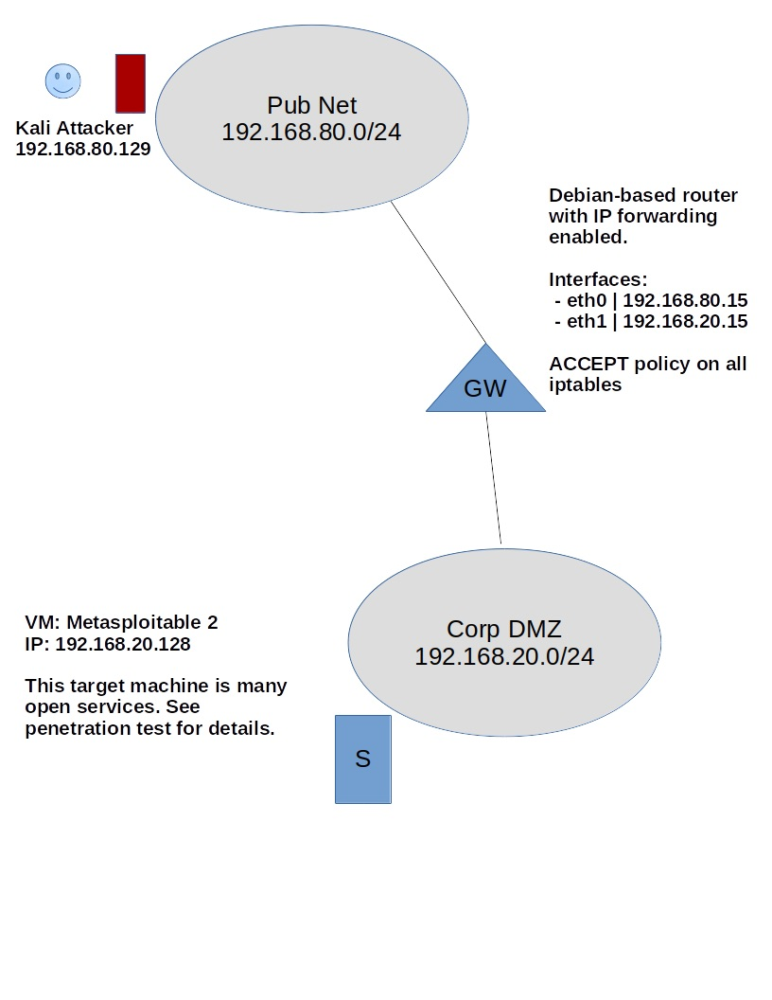

## Setting up the Environment

In this step, we will setup the target environment, wherein we will do our testing. We will be using a type two hypervisor – VMware Workstation Pro – meaning that the hypervisor runs on top of the operating system rather than on the “bare-metal”. We will then create a network target range and populate it with machines.

## Requirements

- OS: Windows or Linux-based 64-bit host machine for running VMware Workstation Pro
- Hypervisor Software: VMware Workstation Pro (compatible with Windows and Linux hosts)
- Minimum RAM: 8B (Recommended 12GB+)
- Virtual Machines: Kali, Debian, Metasploitable 2

I will be using 64-bit Ubuntu 18.04 Workstation as the host OS and will provide instructions according to this distribution. Please be advised that this lab will not cover translating instructions to its Windows, or other Linux-based OS’ counterparts. If the reader would like to simply follow along, I recommend using Ubuntu 18.04 Workstation as the host operating system.

## Downloading the Software

#### Ubuntu 18.04 Workstation (Host Operating System)

If you’d like to follow along using Ubuntu as the host operating system, you can download a desktop image from http://releases.ubuntu.com/18.04/ and choose your preferred installation method.

After installation, run the commands below in a Terminal to update the latest software packages.

`sudo apt update && apt upgrade -y`

Restart your machine.

#### VMware Workstation Pro (Hypervisor)

Download the latest VMware Workstation Pro for Linux [here](https://my.vmware.com/web/vmware/details?downloadGroup=WKST-1257-LX&productId=524&rPId=17068) and install in on your system. The software comes with a 30-day trial period, after which you will need a license.

#### Kali (Offensive Machine)

Offensive-security provides VMware-ready images for Kali. You can find them [here](https://www.offensive-security.com/kali-linux-vmware-virtualbox-image-download/). Choose the tab “Kali Linux VMware Images” and download “Kali Linux 64 bit VM”. We will use this image to create the attacker machine within VMware.

#### Metasploitable 2 (Target Machine)

Rapid7 provides a VM snapshot containing many security vulnerabilities. This allows us flexibility for performing various penetration tests and is useful in a lab. Download Metasploitable 2 from [this linke](https://sourceforge.net/projects/metasploitable/files/Metasploitable2/).

Note that Rapid7 has released Metasploitable 3 with many additional features. At the time of writing this, I was unable to finish doing tests with that VM.

#### Debian (Software-based router)

We will use Debian as a software router for routing incoming and outgoing IP packets to their appropriate destinations.

To download, go to [here](https://cdimage.debian.org/debian-cd/current/amd64/iso-dvd/), scroll down and click “debian-9.0.0-amd64-DVD-1.iso”.


## Configuring the Network Range

#### Setting up VMnets

In VMware Workstation, we will setup our network infrastructure as it's detailed in the initial network diagram.

To do this, open **VMware Workstation** and click on **Edit | Virtual Network Editor | +Add Network**.

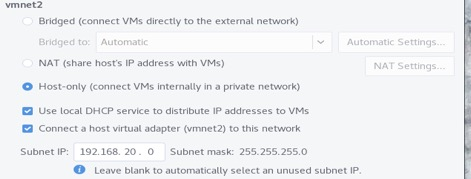

Here, we create our subnets. Enter **vmnet2** under **Network name:** and select the radio button **Host-only** as the type, then click **+Add**. Then, configure the network according to the image below.

Note that we've checked **Connect a host virtual adapter (vmnet2) to this network**. This is temporary until we test & verify that we can reach other hosts within a flat network. Later, we will disable this on vmnet2 during the test.

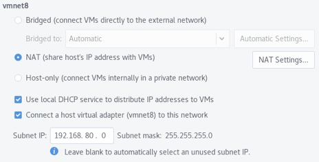

Repeat the steps to create VMnet8, but using the config settings below.

#### Setting up the Hosts (Attacker & Target)

On **VMware Workstation**, click **File | New Virtual Machine | Typical (recommended) | Next | Use ISO image**; browse and select the Kali image you've downloaded from the previous steps. Continue through the next steps and use the image below to configure the Kali machine.

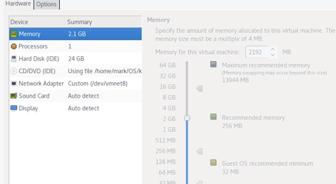

Make sure the Network Adapter is set to **vmnet8**. When the machine boots, follow the instructions to complete installing Kali. Kali will reboot when it's done. Login with the username **root** and whatever password you've set. Upgrade the system by entering the following command in a terminal.

`apt update ** apt upgrade -y`

Repeat the same steps to install Metasploitable 2 target machine, but setting the Network Adapter on **vmnet2**. Login to the machine using the user / pass msfadmin / msfadmin. Your IP address may differ from what our diagram has. Take not of it by entering the following command

`ip addr show eth0 | grep -w inet`

Test that we can access the target host on a flat network. Go to a browser on your local machine, and enter "http://<target ip addr>" and make sure you can see the Metasploitable 2 webpage.

#### Setting up the Network Assets

Following the same procedure, install a Debian machine using the image below as reference as we're configuring it with two network interfaces. Update & upgrade the machine.

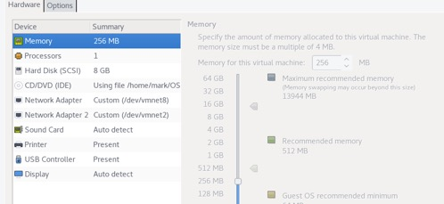

The router sits between the subnets and will forward IP addresses to the correct host. It should use static IP addresses so that the hosts do not need to reconfigure their default gateway. We’ll configure this with the follow command. This is all one command, so make sure everything is typed correctly (copying/pasting might not work).

```
sudo tee /etc/network/interfaces << END
# This file describes the NICs available on your system

source /etc/network/interfaces.d/*

auto eth0
iface eth0 inet static
address 192.168.80.15
netmask 255.255.255.0

auto eth1
iface eth1 inet static
address 192.168.20.15
netmask 255.255.255.0ipt

auto lo
iface lo inet loopback
END
```

Reboot the machine and verify that the addresses are configured to what we set.

`sudo ip a | grep -w inet`

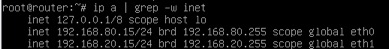

#### Connect the Hosts on a Layered Network

We will now need to tell our attacker and target machines to use the router we’ve just set up as their gateway.

On the Kali machine, open a terminal and enter the following command to route traffic to vmnet2 through our Debian-based router.

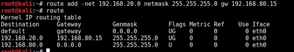

On the target host, use the command below to route traffic to vmnet8

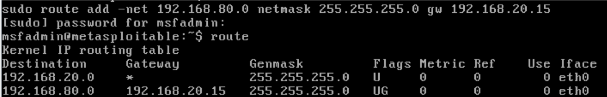

We test that the hosts can reach others on a layered network. We disable vmnet2's connection to the host

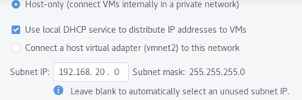

and on the Kali machine, ping the target host; vice-versa. If it succeeds, we've successfully created our network infrastructure.

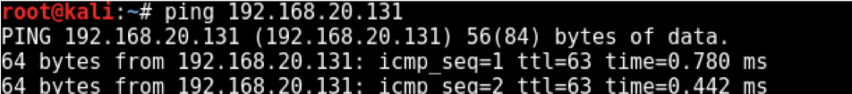

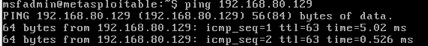

## Penetration Methodology

The methodology is a combination of the Penetration Testing Standard (PTES) and the National Institute of Standards and Technology (NIST) cybersecurity framework. It allows  us the most flexibility in designing our methodology based on the target range and goals of the penetration test. In this test, we know that the targets are Linux  servers. We will research ways we can gain privileged access to the servers by exploiting different vulnerabilities. Below shows what steps we’ve taken from each methodology, that we will use for this test.

You can read more about both standards from their websites (below)
- [Penetration Testing Standard](http://www.pentest-standard.org/index.php/Main_page)
- [National Institue of Standards and Technology](http://nvlpubs.nist.gov/nistpubs/Legacy/SP/nistspecialpublication800-115.pdf)

#### 1. Planning (NIST)

This is a *white box* penetration test as I’m fully aware of the target network infrastructure and configuration. I know the assets (i.e., services, servers, operating systems, kernels, etc.) within the target network and have researched the target servers’ vulnerabilities and exploits.

I would like to reiterate that the goal of this test is to gain privileged access to the target Linux and Windows servers.

#### 2. Intel Gathering (PTES)

Here, we will use Nmap to scan and provide information about the target servers and other network assets’ IP addresses and open services.

We will consult some online resources (i.e., Exploit DB) to gather vulnerabilities based on the services we discover. Then we will research if there are exploits available for those vulnerabilities that allows us to gain administrative access to the machines.

#### 3. Execution - Identify & Analyze Vulnerabilities (NIST)

Here we validate if the vulnerability exists within the target machine and if it would most likely succeed during the exploitation phase. We sift out some vulnerabilities and exploits that do not move us toward our goal and also devise secondary plans should the primary exploits fail.

#### 4. Exploitation (PTES) / Attack Phase (NIST)

Here we attempt to validate the vulnerabilities using the exploits we’ve researched discovered. If successful, we should have gained privileged access to the target servers. If not, we try something else.

#### 5. Repeat (NIST)

If necessary, we will repeat the process above in order to delve further into other subnetworks by pivoting from the current host. In this test, we will repeat after we’ve finished testing one server.

## Applying Methodology to Target Range

Now that we’ve established our desired methodology and have built our testing range, we can begin applying the methodology to our range. At this point, it is important to reiterate the goals and scope of the penetration test. In our case, apart from providing a testing lab, we hope to accomplish the following objectives:

- Explore the target range and find machines we can exploit
- Gain privileged access to any machines
- Provide remediation recomendations

#### 1. Planning

In the first step of our methodology, we define our goals and scope for the penetration test. This test is successful if we are able to gain privileged access to the targeted machines within our target range and provide a remediation recommendations.

We are using Rapid7’s Metasploitable 2 with all default settings. Only the route needs to be configured so that it can reply to calls from outside the network. We do this by adding a route to the 192.168.80.0/24 network.

**Open a terminal**. Then run the command `route add default gw 192.168.20.15` in order to add the route.

Test this by pinging the server from the Kali attacker machine. You can obtain the target’s IP address by entering `ipconfig` and looking for the IPv4 Address. If everything works, you should receive a ping reply from the server.

#### 2. Intel Gathering

Using Nmap, we scan for hosts within the DMZ subnet that we're targeting

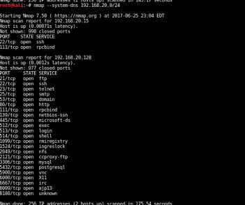

We’ve picked up our target (the one with many open services). The other machine is our Debian router forwarding IP packets to this machine.

We’ll do another scan to get more info about these services.

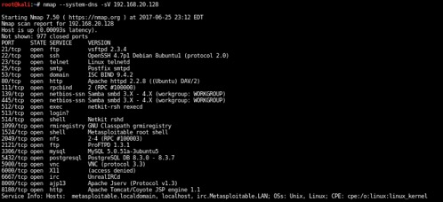

We’ve confirmed that **192.168.20.128** is running a host of open services and is a prime target for penetration testing. Now we can move to researching and looking for vulnerabilities.

#### 3. Identify Vulnerabilities

We can use various tools to identify vulnerabilities within various levels (i.e., service, operating system, application, etc…). A couple useful online databases include www.exploit-db.com and https://packetstormsecurity.com. They provide up-to-date information about the latest vulnerabilities with available exploits.

Once we’ve found some vulnerabilities that match to some of the services on our target machine, we can assess and test if the exploit will fulfill our primary objectives detailed in the planning section.

#### 4. Vulnerability Analysis

In this step, we determine if the vulnerability has an exploit that would meet our goals. Since we know our target has a variety of vulnerabilities, we’ll be focusing on a particular vulnerability that has a proven exploit.

However, it is usually the case that the vulnerability you discover does not have an exploitation that meets your needs. This step is important as you’ll analyze and hope to discover which vulnerabilities is the easiest to exploit in order to meet your goal.

I’ve done most of the analysis and testing across most of these services. In this example, we’ll be exploring the open IRC service on port 6667. There is an available exploit that allows us to obtain an interactive shell. See www.cvedetails.com/cve/cve-2010-2075 for details on the vulnerability and https://www.rapid7.com/db/modules/exploit/unix/irc/unreal_ircd_3281_backdoor for details on the Metasploit exploit package. The module exploits a malicious backdoor that was added to that version’s download archive.

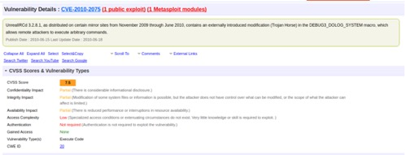

#### 5. Exploitation

Now, we attempt to exploit the service from our Kali machine. We use Metasploit to search and use the modules according to our research. Open a terminal with root access and enter **msfconsole** to start the Metasploit console.

Then we use the module as listed from our research, set the target host, and attempt to exploit.

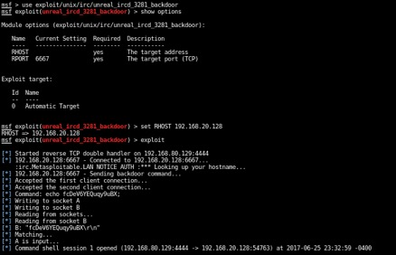

We’ve succeeding gaining root access to the target machine. From this point, it’s game over.

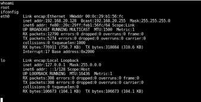

#### 6. Repeat / Iterate (Planning + Gathering Intel)

Now that we’ve successfully hacked the our target machine, we could delve deeper into the target’s network by installing tools and repeating the steps above. There are ways to install software whilst minimizing detection from IDS or AV (i.e., installing from memory without touching the disk). If there were machines we could not access from within a trusted network, but has open services to this machine we’ve just hacked, we can attempt to exploit those services to obtain access to that trusted machine.

## Post-Exploitation Report/Assessment

Here, we provide more information about our penetration test, including details to the vulnerability and exploit we used, how we used them, and available steps to mitigate future attacks.

#### Analysis of Vulnerability

Target machine 192.168.20.128 had many open services available. The vulnerability we exploited to gain root access to the system was CVE-2010-2075 / OSVDB-65445.

See advisory from vendor at https://www.unrealircd.org/txt/unrealsecadvisory.20100612.txt.

Additional details to the vulnerability can be found at https://www.cvedetails.com/cve/cve-2010-2075. See screenshot below.

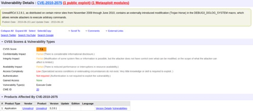

#### Analysis of Exploit

The exploit was available in one of Metasploit’s modules and can be found in www.exploit-db.com. See www.rapid7.com/db/modules/exploit/unix/irc/unreal_ircd_3281_backdoor for more information about the exploitation module used for this test.

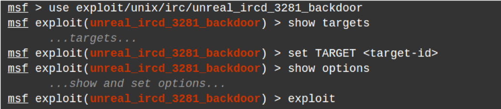

This exploit utilizes the backdoor that was maliciously implanted into one of the UnrealIRCD’s download archives, which went unnoticed for months. It is triggered by sending the letters “AB” following a system command to the server on any listening port. This was added to Metasploit’s modules in order to easily gain an interactive shell on affected systems as shown above.

## Mitigations

#### Firewall

This test did not utilize a firewall and thus the attacker had no difficulty accessing the target machine. There are many firewall solutions to choose from that provide an additional hurdle the attacker must go through before accessing the network. If using multiple subnetworks, we recommend utilizing firewalls from differing vendors in order to mitigate the risk of attack should the vendor have a vulnerability. Example firewalls include Smoothwall and Pfsense.

#### Hardening of target machine

The target machine has many open services. We assume that this machine is not utilizing all the open services and thus it is highly recommended to only allow what services are necessary for this server. In this case, a system administrator could have closed the vulnerable port or service. In addition, there are additional configurations within the target machine that could further the security posture of the system. If a service is required, it should be configured to allow the bare minimum connections, IP addresses, etc., so that there are additional hurdles to exploitation.

###### References
- http://www.cvedetails.com/cve/cve-2010-2075
- http://www.rapid7.com/db/modules/exploit/unix/irc/unreal_ircd_3281_backdoor
-	https://www.unrealircd.org/txt/unrealsecadvisory.20100612.txt
-	https://www.rapid7.com/db/modules/exploit/unix/irc/unreal_ircd_3281_backdoor
